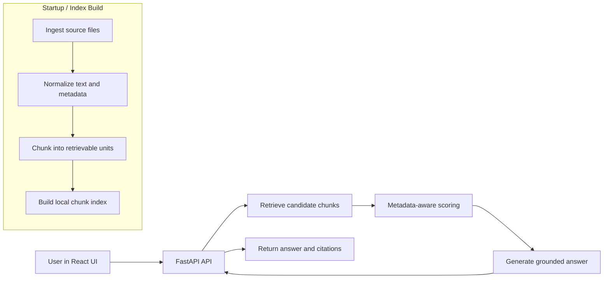

# SCARAG
Schema-Conscious Agnostic RAG (Retrieval-Augmented Generation)

**Metadata-first RAG for any domain, and supported format**

T. Transou - June 2026 - Active Development 🚧

## One-Sentence Claim
SCARAG is a metadata-first RAG framework for building document-grounded systems where provenance, lifecycle, confidence, and domain semantics are first-class concerns.

## Why SCARAG Exists
- Naive RAG treats documents as text blobs.
- Real implementation corpora are governed artifacts.
- Reliable answers require metadata-aware retrieval, lifecycle controls, confidence assessment, and evidence visibility.

SCARAG is not trying to make generation sound confident. It is designed to make evidence legible, traceable, and governable.

## Implementation Status
This repository is a public framework baseline of the SCARAG framework, developed from framework documentation and architectural notes.

This README serves four roles at once:
- project overview,
- implementation roadmap,
- implementation guide,
- truthful description of what the current public code does today.

Some sections describe implemented functionality in this repository. Other sections are explicit roadmap targets that define what still needs to be built. Those targets remain here by design.

Status synchronization rule:
- when a roadmap target changes to partial or implemented, update this README and docs/implementation-status.md in the same change set.

## Core Premise
Most RAG systems fail long before generation quality becomes the main issue. They fail because retrieval lacks evidence governance: source identity, metadata quality, freshness, lifecycle state, and domain semantics.

SCARAG treats retrieval as evidence governance, not only similarity search.

## What the Name Means
SCARAG = Schema-Conscious Agnostic RAG.

Schema-Conscious:
- schema is treated as an interpretive layer, not a convenience layer,
- retrieval quality depends on explicit source meaning and metadata state.

Agnostic:
- the framework is domain-agnostic but not domain-indifferent,
- implementation teams are expected to tailor ontology, vocabulary, lifecycle policy, and confidence behavior by domain.

RAG:
- retrieval-augmented generation remains the operating pattern,
- answers are expected to remain anchored to retrieved evidence and provenance.

In short: agnostic does not mean generic.

## Design and Evaluation Philosophy
First things first:
- Schema before generation
- Provenance before fluency
- Domain tailoring before generic automation
- Abstention before unsupported synthesis
- Retrieval as evidence governance, not only similarity search

Evaluation is used as diagnosis, not decoration.

The objective is not one benchmark number. The objective is failure visibility: ingestion, chunking, retrieval, metadata weighting, tabular grounding, abstention behavior, evidence presentation, and generation behavior should all be diagnosable.

SCARAG is a framework posture, not only a code package:
- make evidence legible before asking the model to speak,
- treat abstention as correct behavior when support is weak,
- keep framework primitives separate from implementation-specific deployment and provider choices.

## Architecture at a Glance


## Capability Matrix
| Capability | Current public status | Current implementation surface | Roadmap alignment / next step |
|---|---|---|---|
| multi-format ingestion | Implemented (baseline) | scarag/ingestion/loader.py handles txt, md, recursive-json flattening, csv, html/htm, nested multipart mhtml/mht, pdf, docx, pptx, xlsx/xls with extraction metadata | Expand parser diagnostics and domain-specific extraction policies |
| document type inference | Implemented | scarag/pipeline.py infer_doc_type | Expand taxonomy and profile-driven typing |
| prose chunking | Implemented (baseline) | scarag/pipeline.py prose source-unit segmentation + _chunk_prose windowing | Tune cohesion thresholds and domain-specific segmentation policies |
| tabular chunking | Implemented (baseline) | scarag/pipeline.py _looks_tabular + _chunk_tabular metadata-aware row windows/header sectioning with repeated-header chunk metadata and sheet-local spreadsheet row fidelity | Improve advanced table detection heuristics across formats |
| metadata propagation | Implemented (baseline) | canonical evidence fields include source, chunk_id, source_unit_id, extraction and lifecycle metadata, confidence inputs, table metadata, and image markers where available | Extend with richer parser diagnostics and confidence debug traces |
| provenance/citations | Implemented (baseline) | api_server.py citation envelope, provenance completeness validator, citation-quality enforcement, and frontend evidence drawer | Add source-resolvable links and richer citation metadata validation |
| thesaurus/query expansion | Implemented | config/synonyms.json + scarag/pipeline.py expand_query_terms | Add profile overlays, governance for term drift, and diagnostics |
| lexical retrieval | Implemented (baseline) | scarag/pipeline.py retrieve_chunks with configurable lexical similarity metrics and configurable metadata weighting rules | Tune weights and add calibration tooling |
| vector or TF-IDF retrieval | Implemented (baseline) | TF-IDF backend implemented with cosine normalization; vector backend implemented via configurable embedding adapter and vector similarity metric selector | Add calibration path and domain tuning |
| hybrid reranking | Implemented (baseline) | lexical + TF-IDF reciprocal-rank-fusion scaffold via retrieval interface | Expand diagnostics and semantic blending policies |
| confidence resolver | Implemented (baseline) | resolver consumes extraction tier + lifecycle signal + retrieval strength + evidence coverage, applies configurable temporal decay, applies framework-level intent alignment boosts/penalties, and emits high/low/abstain | Add profile/domain overlays and richer debug traces |
| lifecycle/freshness controls | Implemented (baseline) | persistent lifecycle state, freshness filtering, status filters, retrieval diagnostics, and lifecycle audit reporting utility (`scripts/lifecycle_audit_report.py`) | Expand API surfacing for lifecycle diagnostics |
| soft delete/re-ingestion state | Implemented (baseline) | file-backed state store with source_unit_id, ingestion/upsert timestamps, status, soft-delete marks, skip-unchanged auditing, and hard purge utility (`scripts/lifecycle_cleanup.py`) | Add timeline visualization and retention-policy helpers |
| tabular grounding | Implemented (baseline) | tabular intent detection, abstention when tabular evidence is absent, strict matched-row grounding, schema-style fallback guardrails, PDF-table limits, and trace output | Add more corpus-specific tabular evaluation coverage and tuning |
| generation modes | Partial | extractive, mock, live placeholder, and structured grounded-answer result in scarag/generation/answerer.py | Add provider adapters for live mode |
| citation response contract | Implemented | docs/reference-ui-contract.md and api_server.py response fields | Expand contract tests and richer citation metadata |
| reference API | Implemented | api_server.py /api/health and /api/chat | Add config endpoints and diagnostic surfaces |
| reference UI | Partial | frontend/src/App.jsx and styles.css implement shell, drawer, feedback scaffold | Wire feedback persistence and expand evidence interactions |
| offline evaluation | Implemented (baseline) | scripts/run_eval.py outputs JSON/Markdown reports with retrieval/provenance/abstention/tabular/confidence expectation metrics | Add richer datasets, dataset sanity checks, and deeper governance checks |
| domain profiles | Partial | profiles/default.json + RagConfig.from_profile | Add domain-specific profiles and confidence overlays |
| deployment guidance | Partial | start scripts and README run path | Add deployment playbooks and cloud adapter references |

## Operational Design Docs
The README is intentionally philosophy-first and status-oriented. Detailed operational and implementation design is maintained in the docs set below.

- Implementation tracking: docs/implementation-status.md
- Metadata model: docs/metadata-model.md
- Retrieval design: docs/retrieval-design.md
- Lifecycle and freshness design: docs/lifecycle-design.md
- Confidence framework design: docs/confidence-framework.md
- Tabular grounding design: docs/tabular-grounding.md
- Grounded answer contract: docs/generation-contract.md
- API contract migrations: docs/api-contract-migrations.md

## Current Public Surfaces
- Core package: scarag/
- Reference API: api_server.py
- Reference UI: frontend/
- Operational scripts: scripts/
- Configuration and synonyms: config/
- Domain profiles: profiles/
- Offline evaluation workspace: eval/
- Regression tests: tests/
- Design and contract docs: docs/

## Framework Capabilities
### Ingestion - Status: Implemented (baseline)
Current implementation baseline:
- Parses txt, md, json, csv, html/htm, mhtml/mht, pdf, docx, pptx, xlsx/xls.
- Uses recursive JSON flattening for nested dict/list paths.
- Adds DOCX/PPTX/XLSX/XLS table metadata (table_id, row_count, column_count, header_fields).
- Adds nested multipart MHTML part handling with html/plain decode fallback.
- Adds baseline PDF table extraction with text fallback.
- Emits extraction_method and extraction_ts metadata and propagates image markers where non-text objects are detected.

Roadmap targets:
- parser-level diagnostics and richer extraction quality signaling,
- stronger PDF table guardrails for high-assurance row grounding.

### Chunking - Status: Implemented (baseline)
Current implementation baseline:
- Creates prose chunks with chunk size, overlap, and minimum word controls.
- Applies configurable lexical cohesion splitting to create prose source units before chunking.
- Detects table-like content heuristically and chunks by row windows with metadata-aware header sectioning.
- Preserves repeated header occurrences and row-window bounds in per-chunk tabular metadata.
- Preserves sheet-local row boundaries and absolute/local row offsets for XLSX/XLS chunk traceability.
- Applies chunk-type overlap policy with normalized defaults: prose min chunk size 20 words with overlap clamped below chunk size, tabular min 1 row with overlap clamped below window size.
- Preserves source-unit boundaries in chunk metadata and propagates chunk/ingestion metadata through retrieval outputs.
- Suppresses duplicate full-document fingerprints during indexing.

Roadmap targets:
- tune cohesion thresholds and segmentation policy by domain profile.

### Schema-Conscious Retrieval and Metadata-First Scoring - Status: Implemented (baseline) / Partial
Current implementation baseline:
- Query expansion from config/synonyms.json.
- Lexical retrieval with configurable similarity metrics (overlap, jaccard, containment) and configurable metadata weighting rules.
- Persisted repeated-boilerplate signals with configurable boilerplate penalty factors during ranking.
- Table-aware boosting tied to tabular intent and row/header matches.
- TF-IDF backend with cosine normalization.
- Vector backend with configurable embedding adapter boundary (default hashing embedder) and vector similarity metric options (cosine, dot, euclidean).
- Hybrid lexical + TF-IDF reciprocal-rank-fusion scaffold via retrieval interfaces.
- top_k and minimum retrieval score controls.
- Retrieval diagnostics output mode for query terms, candidate pruning counters, and final rank explanations.

Roadmap targets:
- calibration tooling and richer domain profiling for retrieval behavior.

### Provenance and Evidence Presentation - Status: Implemented (baseline)
Current implementation baseline:
- API returns contract_version, message, citations_summary, citations, collapsed_citations, answer, confidence.
- Provenance completeness validator is integrated and surfaced in diagnostics/evaluation.
- Citation-quality checks enforce snippet adequacy, source traceability, and duplicate-policy behavior before citation emission.
- Frontend renders answer-first with right-side evidence drawer.
- Evidence cards are visible and low-signal cards can be collapsed.

Roadmap targets:
- source-resolvable links and richer citation metadata validation.

### Lifecycle and Freshness - Status: Implemented (baseline)
Current implementation baseline:
- Lifecycle state is persisted in a file-backed store keyed by source_unit_id.
- Chunks include lifecycle timestamps, status, and soft-delete markers.
- Retrieval enforces lifecycle policy filters (soft-delete exclusion, status allow/deny, freshness cutoff) with diagnostics.

Roadmap targets:
- lifecycle audit reporting and richer re-ingestion compliance telemetry.

### Confidence Assessment - Status: Implemented (baseline)
Current implementation baseline:
- API exposes confidence signal (high, low, abstain) produced by a resolver using extraction/lifecycle/retrieval inputs.

Roadmap targets:
- domain overlays and richer confidence debug traces.

### Domain Profiles and Ontology/Taxonomy Tailoring - Status: Partial
Current implementation baseline:
- profiles/default.json is loadable through RagConfig.from_profile.
- Synonym and tabular intent vocabulary are configurable in config/synonyms.json.

Roadmap targets:
- richer domain profiles,
- profile overlays for retrieval/lifecycle/confidence,
- ontology/taxonomy governance workflows.

### Tabular Grounding and Abstention - Status: Implemented (baseline)
Current implementation baseline:
- Tabular intent detection exists.
- If tabular intent is detected and no tabular evidence is retrieved, the system abstains.
- Strict matched-row evidence selection and grounding trace output are implemented.
- Schema-style fallback policy is defined and limited to structure-only cases.
- Explicit PDF table grounding limits are defined for ambiguous extraction cases.

Roadmap targets:
- extend corpus-specific tabular evaluation and tuning.

### Evaluation as Diagnosis - Status: Implemented (baseline)
Current implementation baseline:
- scripts/run_eval.py runs offline evaluation and writes JSON/Markdown reports in eval/reports.
- Baseline metrics include retrieval, provenance completeness, abstention rate, tabular compliance, lifecycle exclusion compliance, confidence/tabular expectation alignment, tabular answer success, and tabular abstention correctness.

Roadmap targets:
- expanded datasets in eval/datasets,
- richer semantic and human-reviewed evaluation layers.

### Framework Versus Implementation Boundaries - Status: Implemented
SCARAG intentionally separates framework primitives from implementation-specific choices.

Framework-owned surfaces in this repo:
- ingestion, chunking, retrieval baseline,
- answer contract and evidence presentation baseline,
- offline diagnostic evaluation baseline.

Implementation-owned surfaces:
- live LLM provider integration,
- deployment topology, auth, and observability,
- domain-specific policy and ontology governance.

## Reality Snapshot
- Generation modes available: extractive (default), mock, live placeholder.
- Live mode is an adapter hook and currently returns a clear provider-not-configured message.
- Generation returns structured grounding diagnostics, including abstention reason codes and cited chunk ids, behind the API envelope.
- The React frontend is a reference implementation and can be replaced by implementers.
- Feedback capture is scaffolded in the UI but persistence wiring is not implemented.
- API responses now include a `contract_version` field, and migration notes for response-field evolution are tracked in docs/api-contract-migrations.md.

## Run the Reference Stack (React + FastAPI)
Quick start from repo root:
```bash
bash ./start_everything.sh
```

This launches:
- React UI at http://127.0.0.1:3000
- API at http://127.0.0.1:8000

Health check:
```bash
curl http://127.0.0.1:8000/api/health
```

Manual startup:
```bash
cd frontend
npm install
npm run dev
```

In another terminal from repo root:
```bash
./.venv/bin/python -m uvicorn api_server:app --reload --host 127.0.0.1 --port 8000
```

## Contributor Guide
Primary edit surfaces:
- api_server.py: API contract, chat envelope, citation shaping.
- scarag/: ingestion, retrieval pipeline, generation modes, config behavior.
- frontend/src/App.jsx and frontend/src/styles.css: reference UI and evidence drawer behavior.
- frontend/src/responseNormalization.js: frontend response normalization and legacy payload fallback behavior.
- scripts/: startup, dedupe, eval, workspace reset.
- docs/: design notes and UI/evaluation contracts.

Typical local workflow:
1. Run bash ./start_everything.sh.
2. Edit the smallest owning surface.
3. Re-run python -m pytest tests.
4. Update docs when contracts or behavior change.

## Repo Map (Current)
- scarag/
  - config.py: RagConfig and profile loading
  - ingestion/loader.py: file loading and format parsing
  - pipeline.py: chunking, doc typing, thesaurus, retrieval
  - retrieval/ranker.py: standalone overlap rank helper
  - generation/answerer.py: extractive/mock/live answer modes
- api_server.py
  - FastAPI endpoints and response envelope for the reference UI
- frontend/
  - React reference UI and evidence drawer shell
- scripts/
  - run_eval.py, dedupe_corpus.py, start/reset helpers
- eval/
  - datasets and reports workspace (gitkeep placeholders in clean clone)
- tests/
  - API and dependency/parser regression tests
- docs/
  - architecture notes, UI contract, evaluation blueprint

## Testing
```bash
python -m pytest tests
```

## Documentation Expansion Plan
If README detail continues to grow, keep philosophy and matrix here, and move deep operational design into dedicated docs:
- docs/implementation-status.md
- docs/metadata-model.md
- docs/retrieval-design.md
- docs/lifecycle-design.md
- docs/confidence-framework.md
- docs/tabular-grounding.md

These files are recommended next additions for active implementation clarity.

## Bibliography and Attribution
SCARAG draws on established work in retrieval-augmented generation, attribution, and evaluation.

- Lewis et al. Retrieval-Augmented Generation for Knowledge-Intensive NLP Tasks (2020)
- Asai et al. Self-RAG (2023)
- Gao et al. Retrieval-Augmented Generation for Large Language Models: A Survey (2023)
- Es et al. RAGAS (2023)
- Bohnet et al. Attributed Question Answering (2022)
- Yue et al. Automatic Evaluation and Improvement of Attribution in LLMs (2023)
- Nakano et al. WebGPT (2021)
- Ouyang et al. Training Language Models to Follow Instructions with Human Feedback (2022)

Where SCARAG makes claims about robustness, abstention, provenance, confidence, or evaluation design, implementation work should prefer cited literature and explicit diagnostics over unsupported assertions.
