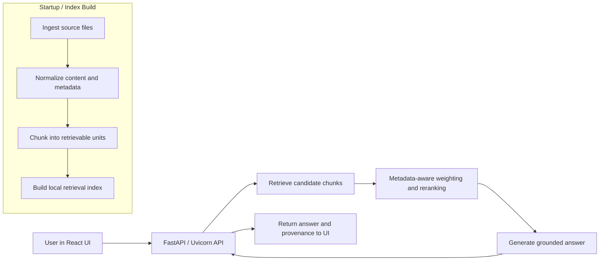
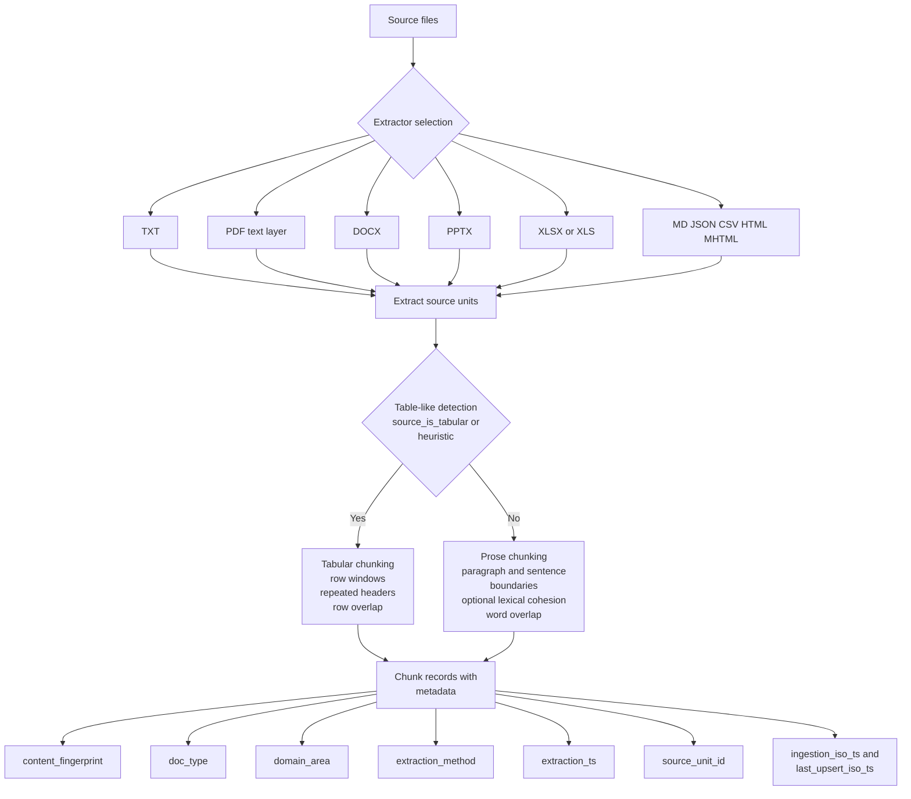
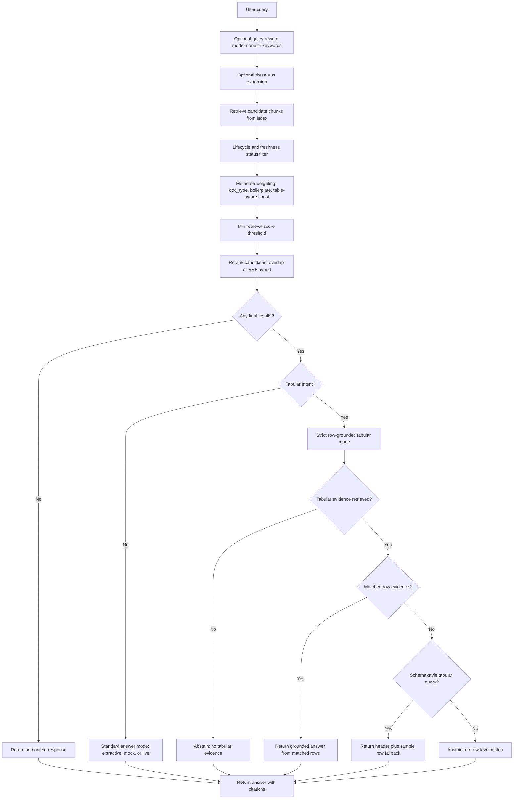
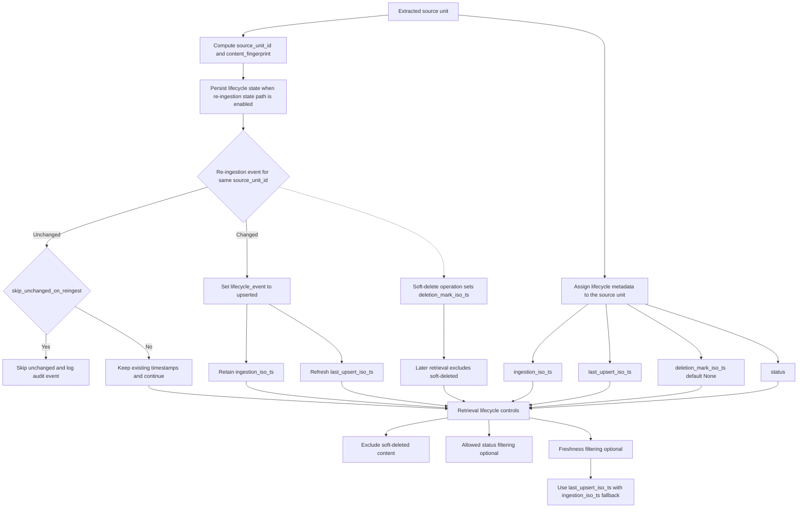

# SCARAG
Schema-Centric Agnostic RAG (Retrieval-Augmented Generation)

## Metadata-first RAG for any domain, and supported format

### T. Transou - June 2026


SCARAG is a configurable framework for document-grounded retrieval and answer synthesis.

The included runtime is a reference stack: a single FastAPI/Uvicorn process that serves API endpoints and built React assets.


## What the Name Means

  SCARAG = Schema-Centric Agnostic RAG

**Schema-Centric:**
- The framework prioritizes field semantics, provenance metadata, and lifecycle signals over naive document-only parsing.
- Retrieval and ground quality improve when data meaning is explicit.

**Agnostic:**
- Domain-agnostic: finance, legal, insurance, IT, test results, and other domains can all be tailored through profiles.
- Format-agnostic: the same framework core works across text, tabular, and mixed document formats.

**RAG:**
- Retrieval-Augmented Generation remains the operational pattern.
- Answers are expected to stay anchored to retrieved evidence and provenance.

The name also reflects scar tissue from prior naive approaches: hard-earned lessons turned into explicit framework design principles.


## Executive Summary

Most RAG projects fail in the same places: weak grounding, unclear provenance, poor domain fit, and brittle one-off implementation choices. This framework addresses those failure modes with reusable primitives for ingestion, chunking, retrieval tuning, confidence signaling, lifecycle/freshness policy, and evidence presentation.

Why this matters:
 - It separates framework concerns from implementation concerns.
 - It makes domain adaptation explicit instead of implicit.
 - It keeps answers accountable to source evidence.
 - It supports iterative evaluation before and after domain tailoring.

How this is useful in practice:
- Start with shared framework defaults and a reference runtime.
- Apply human-owned NLP tailoring for vocabulary, ontology, and policy.
- Validate behavior with domain datasets and metrics.
- Evolve implementation-specific provider, deployment, and UX layers without rewriting framework core.

In short: this framework is a reusable RAG foundation that helps teams move faster while preserving traceability, control, and domain fit.


## Architecture at a Glance

The reference stack follows one end-to-end path: ingest source files, turn them into retrievable units, retrieve relevant chunks, and return grounded answers with provenance.



## Reality Snapshot
- Included reference UI target: desktop browser
- Evidence UX contract is answer-first with source-on-demand citations in a right-side drawer.
- Dense evidence handling is implemented:
  - repeated citation cards are deduped
  - low-signal citations are collapsed by default
  - collapsed evidence remains available on demand
- Generation modes available:
  - `extractive` (default)
  - `mock` (deterministic offline model)
  - `live` (adapter hook exists; provider integration is intentionally implementation-specific)
- The React layer is reference only and can be replaced or reshaped by implementers.


## Run Reference Stack (React + Uvicorn)
The React frontend under `frontend/` is a reference interface for exercising framework APIs and evidence contracts.

Prerequisites:
- Python virtual environment at `.venv` with project dependencies installed
- Node.js available for frontend build
- A local corpus under `data/` (override with `RAG_DATA_PATH`)

Build frontend once (or after UI changes):
  ```bash
  cd frontend
  npm install
  npm run build
```
Run unified server from repo root:
  ```bash
  .\.venv\Scripts\python -m uvicorn api_server:app --reload --host 127.0.0.1 --port 8000
```
One-command startup script:
```bash
powershell -ExecutionPolicy Bypass -File .\scripts\start_everything.ps1
```
Common options:
```bash
powershell -ExecutionPolicy Bypass -File .\scripts\start_everything.ps1 -SkipFrontendBuild
powershell -ExecutionPolicy Bypass -File .\scripts\start_everything.ps1 -Domain finance -TopK7
powershell -ExecutionPolicy Bypass -File .\scripts\start_everything.ps1 -GenerationMode mock
```
Endpoints:
```bash
http://127.0.0.1:8000 for React UI
http://127.0.0.1:8000/api/health for API health
```
Reference API endpoint:
```bash
POST /api/chat with body { "query": "..."}
Current response contract includes:
- message.text
- message.citations_summary (count, total_count, hidden_count, label)
- citations (visible cards)
- collapsed_citations (hidden-by-default cards)
- answer (full backend answer text)
```
Frontend principles charter:
```bash
docs/frontend-principles.md
```
Human-owned NLP tailoring guide:
```bash
docs/nlp-tailoring-guide.md
```
Example Azure deployment pattern (implementation-specific)
- Run the API layer in Azure Container Apps
- Use Azure AI Search as a cloud retrieval backend
- Store documents and ingestion artifacts in Azure Blob Storage
- Keep lifecycle metadata and audit state in Blob sidecars or Cosmos DB
- Use Microsoft Entra ID for authentication and Managed Identity for service access
- Send telemetry to Application Insights


## Framework Boundaries (By Design)
- Live LLM provider selection/integration is intentionally owned by implementers (`generation_mode=live` extension point).
- Runtime data, validation corpora, and benchmark scenarios are implementation-specific and should be maintained per implementation/branch.
- This repository focuses on reusable framework primitives (ingest, chunk, retrieve, grounding, evidence UX contract), not a single fixed deployment profile.


## Framework Capabilities (Current Baseline)
- Multi-format ingestion from file or folder (.txt, .md, .json, .csv, .html, .htm, .mhtml, .mht, .pdf, .docx, .pptx, .xlsx, .xls)
- Hybrid chunking (paragraph + sentence boundaries, lexical cohesion, word overlap)
- Source-aware metadata propagation (document + chunk metadata available at retrieval time)
- Local vectorization + retrieval using TF-IDF cosine similarity
- Retrieval-side metadata weighting (doc_type weighting + boilerplate penalities)
- Lightweight answer generation from retrieved context
- FastAPI chat/health API served with Uvicorn for React UI Integration


## Ingestion and Chunking Flow

Each source file is transformed into structured, retrievable units with metadata that later shapes retrieval, grounding, and lifecycle controls.



## Chunking Strategy (hybrid)
- Structural signals prefer paragraph and sentence boundaries.
- Optional semantic signal: implementers can enable lexical-cohesion splitting by setting a non-zero `cohesion_threshold`.
- Retrieval control: enforce min/max word budgets and overlap for continuity.
- Tabular control: detect tabular sources and chunk by row windows while preserving row boundaries.


## Ingestion guarantees by type
- PDF: text-only extraction via parser text layer (no OCR, images, or non-text objects).
- Markdown: paragraph-level ingestion from `.md` sources.
- JSON: key-path flattening for structured content (`path.to.field: value`)
- CSV: row-based ingestion with header-aware key/value row rendering.
- HTML/HTM: DOM text extraction with block-aware paragraph segmentation
- MHTML/MHT: MIME part extraction (`text/html` and `text/plain`) for archival web pages.
- Embedded images: represented as `` markers in the extracted document flow; the image content is not currently ingested.
- DOCX/PPTX/XLSX tables: extracted as row-oriented text blocks and marked as tabular.
- PDF tables: table-like text regions are also extracted into tabular units for row-faithful chunking.
- Tabular chunks repeat header row across chunks with row overlap for retrieval faithfulness.
- Any document type: table-like extracted text is auto-detected and routed through tabular chunking.
- Answer grounding rule: when tabular evidence is retrieved, answers are constrained to matched row evidence; otherwise, the system abstains.
- Tabular intent gating: strict row-grounded mode is triggered for table-like queries (e.g., table, row, column, score, value, metric, matrix, matrice).


## Corpus Hygiene baseline
- Duplicate unit suppression at ingestion time using content fingerprints.
- Repeated boilerplate is kept once and annotated with:
  - `is_repeated_boilerplate`
  - `boilerplate_occurrences`
- Baseline document typing metadata (`doc_type`) is inferred from filename + content heuristics (policy, procedure, faq, guideline, report, contract)
- Per-unit metadata now includes `content_fingerprint` and `domain_area` (default `unknown`).
- Domain profile configs can define `boilerplate_policy` to retain or drop repeated footer/header patterns per implementation:
  - `allow_patterns`: keep repeated text matching these patterns
  - `block_patterns`: drop repeated text matching these patterns.
  - `apply_to_repeated_only`: if `true`, apply the policy only after a pattern is detected as repeated
 Example profile section:
```json
"boilerplate_policy": {
  "allow_patterns": ["regulatory footer"],
  "block_patterns": ["confidential internal footer"],
  "apply_to_repeated_only": true
}
```
Inspect dedupe/boilerplate signals with:
```
python scripts/dedupe_corpus.py --data data --top 20
```
Optional JSON export:
```
python scripts/dedupe_corpus.py --data data --output reports/dedupe.json
```
Tuning knobs in `RagConfig`:
```
- chunk_size: max words per chunk
- overlap: trailing words copied to next chunk
- min_chunk_words: minimum words before a cohesion-based split can trigger
- cohesion_threshold: baseline default is 0.0 (semantic split disabled), implementers can set > 0,0 for domain-specific semantic splitting
- table_chunk_rows: max data rows per tabular chunk
- table_overlap_rows: data-row overlap between tabular chunks.
```


## Configurable Thesaurus
The framework supports a file-driven thesaurus, so retrieval and query intent are fit for use by domain.

- Default path: `config/synonyms.json`
- Retrieval: expands query terms  with configured synonyms.
- Tabular intent: uses `intent_groups.tabular` for strict table-grounded answering.

Example schema:
```JSON
{
  "terms": {
    "table": ["tabular", "matrix", "matrice", "spreadsheet"],
    "score": ["rating", "metric", "value"]
  },
  "intent_groups": {
    "tabular": ["table", "row", "column", "matrix", "matrice"]
  {
}
```
CLI Options:
```
- --thesaurus config/synonyms.json
- --profile finance
- --disable-query-expansion
- --confidence-strategy boost
- --min-confidence medium
- --query-rewrite-mode keywords
- --similarity-metric cosine
- --top-k 5
- --min-retrieval-score 0.25
- --disable-table-aware-boost
- --table-header-match-weight 0.45
- --table-row-match-weight 0.30
- --table-boost-max-multiplier 1.8
- --hybrid-lexical-weight 1.0
- --hybrid-semantic-weight 1000.0
- --backend-rerank-strategy overlap
- --rrf-rank-constant 60
- --show-retrieval-diagnostics
- --show-confidence-debug
- --generation-mode {extractive|mock|live}
- --enable-freshness-filter
- --freshness-max-age-days 90
- --allowed-status active
- --reingestion-state-path .rag_state/reingestion.json
- --skip-unchanged-on-reingest
```
Offline-first development note:
```
- Use --generation-mode extractive (default) or --generation-mode mock when a live LLM is not wired yet.
- --generation-mode live is intentionally adapter-based and will raise a clear runtime message until a provider is connected.
```


## Offline Evaluation Harness (current baseline)
An offline-first evaluation runner is available for quality checks of retrieval and grounding without a live LLM.
```
- Script: scripts/run_eval.py
- Datasets: eval/datasets/canonical.jsonl, eval/datasets/regression.jsonl, eval/datasets/drift.jsonl
- Reports: eval/reports/*.json and eval/reports/*.md
```
Note: datasets and reports are generated during evaluation runs and may be empty in a clean clone until you execute the harness.
Dataset format (JSONL):
```
- One JSON object per line.
- Core fields used by the runner:
  - id: unique sample id
  - query: user question
  - ground_truth: optional expected answer text (for correctness proxy)
  - profile: optional domain label
  - expected_sources: optional list of expected source paths for relevance checks.
  - relevant_chunk)ids: optional list of explicit relevant chunk ids
  - is_tabular_intent: set true for table-focused questions
  - max_doc_age_days: optional freshness policy for sample-level compliance checks
  - allowed_statuses: optional lifecycle status allow list
```
Example row:
```
{"id:"canoncial-006", "query":"Using the company car master log (206a), what rows or fields are tracked?","ground_truth":"","profile":"corporate","expected_sources":["data/206a COMPANY CARE MASTER LOG-RAG.xls"],"is_tabular_intent":true,"max_doc_age_days":3650:"allowed_statuses":["none","active","pending_review"]}
```
Example:
```
python scripts/run_eval.py --data data --dataset eval/datasets/canonical.jsonl --dataset evail/datasets/regression.jsonl --generation-mode extractive
```
Current offline metric bundle includes:
```
- Retrieval: hit_rate_at_k, mrr_at_k, context_precision_at_k
- Answer proxies: faithfulness_proxy, answer_correctness_proxy
- Governance checks: freshness_compliance, lifecycle_status_compliance, provenance_completeness, tabular_grounding_compliance
- Operational: abstention_rate
```
Metric notes:
```
- hit_hit_rate_at_k: at least one relevant result appears in returned top-k
- mrr_at_k: reciprocal rank of first relevant result
- context_precision_at_k: ratio of retrieved results that are relevant
- faithfulness_proxy and answer_correctness_proxy: lexical overlap proxies for offline iteration; these are intentionally lightweight and can be stricter/looser than semantic judgment
- tabular_grounding_compliance: measures whether tabular-intent answers are grounded in retrieved tabular evidence
```
Note: faithfulness/correctness are lightweight lexical proxies in offline mode; LLM-judged metrics can be added later when live model access is available.


## Example Benchmark Snapshot (Reference Validation Run)
Example canonical benchmark from a prior framework validation run (10 samples, policy corpus with tabular guardrails enabled):
```
- Report: eval/reports/canonical_20260602.md
- hit_rate_at_k: 1.0
- mrr_at_k: 0.95
- context_precision_at_k: 0.96
- freshness_compliance: 1.0
- lifecycle_status_compliance: 1.0
- provenance_completeness: 1.0
- tabular_grounding_compliance: 0.2561
```
Interpretation:
- Retrieval and governance are strong on the current canonical slice.
- Tabular grounding improved materially after `.xls` ingestion and tabular strict-mode hardening, but remains below target and is an active improvement area.
Disposable framework-testing workflow:
- Keep temporary test documents in a disposable folder such as `data/_eval_tmp`
- Run evaluations against that folder and generated datasets
- Expunge all generated reports/datasets/test docs/state when done.
- Treat each benchmark cycle as ephemeral: purge after evaluation, then re-add only the next intended test corpus.
Cleanup script:
```
python scripts/reset_eval_workspace.py --dry-run
python scripts/reset_eval_workspace.py --confirm --test-docs-path data/_eval_tmp --clear-default-state
```
If you also want to remove eval datasets:
```
python scripts/reset_eval_workspace.py --confirm --delete-datasets --test-docs-path data/_eval_temp --clear-default-state
```


## Retrieval and Answer-Grounding Flow

Once chunks are available, the system filters, reranks, and grounds them so answers stay relevant, evidence-based, and appropriately constrained.



## Retrieval Best Practices
These are the main tuning parameters to consider when adjusting retrieval behavior for a specific implementation.
- `top-k`: start with a moderate value, such as 5 to 10, for the final context. Retrieve more candidates first if you plan to rerank; then narrow the set before generation.
- `score threshold`: calibrate it on real queries for the chosen embedding model and corpus. Use it together with `top-k` rather than relying on thresholding alone.
- `similarity metric`: use the metric recommended by the embedding model or vector store. Cosine similarity is a common, safe default, but normalization can change how cosine similarity and the dot product behave.
- `chunk size and overlap`: smaller chunks usually improve precision, larger chunks improve context, and overlap should be only as large as needed to preserve continuity. These are ingestion settings, but they strongly shape retrieval quality.
- `query rewriting`: rewrite vague or conversational user queries into concise search terms when needed, but avoid drifting away from the user's intent.
- `hybrid search weights`: favor keyword matching for exact tokens such as error codes, part numbers, and policy IDs. Favor vector similarity when semantic matching matters more than exact phrasing.
- `reranking`: retrieve a broader candidate set first, then rerank before sending context to the LLM. This is often the largest improvement in retrieval quality after chunking.

Current framework status:
- `top-k` is exposed in the CLI and pipeline config.
- Minimum weighted retrieval score filtering is exposed as `--min-retrieval-score`.
- Table-aware score boosting is available using query/header/row token overlap for tabular chunks.
- Query rewriting is configurable with `--query-rewrite-mode` (`none` or `keywords`).
- Local similarity metric selection is configurable with `--similarity-metric` (`cosine`, `dot`, `jaccard`).
- Hybrid rerank blending is configurable via `--hybrid-lexical-weight` and `--hybrid-semantic-weight`.
- Backend reranking supports `overlap` and `rrf` strategies via `--backend-rerank-strategy`.
- `show-retrieval-diagnostics` prints the current search query, candidate counts, and final ranked results.


## Human-Owned NLP Tailoring
Domain adaptation requires deliberate human NLP decisions for vocabulary, ontology, and evaluation semantics.
Use `docs/nlp-tailoring-guide.md` as the implementation checklist for where tailoring is required.
Use `docs/domain-kickoff-worksheet.md` for a 30-minute structured kickoff session with SMEs.

<excluding Azure, refer to the printout>


## Confidence/Provenance Framework
The framework tracks immutable extraction metadata for every chunk, enabling domain-specific confidence assessment.

### Design Philosophy
- **Extraction metadata** (how data was extracted): immutable and universal
- **Confidence assessment** (trustworthiness): computed on-demand, domain-specific

Each chunk carries immutable metadata:
```
extraction_method: str # e.g., "xlsx_native_row", "pdf_text_layer", "docx_native_table", "text_heuristic_table"
extraction_ts: float # Unix timestamp when chunk was extracted
```

Confidence is assessed dynamically via `ConfidenceResolver` using domain-specific rules. Base extraction tiers apply universally:

| Extraction Method    | Base Tier | Reason                                        |
| -------------------- | --------- | --------------------------------------------- |
| xlsx_native_row      | high      | Native XLSX format, no inference              |
| docx_native_table    | high      | Native DOCX table, no inference               |
| pdf_text_layer       | high      | Native PDF text layer, no inference           |
| pptx_native_slide    | high      | Native PPTX slide, no inference               |
| text_heuristic_table | medium    | Detected by pattern matching, minor inference |
| text_line            | medium    | Parsed as-is from text format                 |

### Domain Reconfiguration Required
Confidence assessment is **designed to be reconfigured per domain** for best results. Each domain my apply:
- **temporal decay**: Financial data from 1 year ago does not match current data; insurance policies have effective date windows.
- **intent-based boosting**: tabular queries demand higher confidence thresholds; narrative queries more forgiving.
- **conflict resolution**: Legal contraditions between sources; insurance policy supressions.

### Configuration
**Base config**: `config/confidence_base.json` (framework defaults, all tiers = "medium" or "high")
**Domain overlays**: `config/profiles/{domain}_confidence.json`

Example domain override:
```json
{
  "temporal_deay":{
  "enabled":true,
  "half_life)days":180,
  "source_pattersn":["balance_sheet","annual_report"]
},
"intent_boost":{
  "tabular_query": 1.2,
  "narrative_query":0.95
  }
}
```


### Usage (future CLI)
```bash
python main.py --data data --profile finance --confidence-strategy boost --query "revenue by quater"
```


## Freshness and Lifecycle Tracking
Every ingested document is tagged with **ISO 8601 timestamps** for lifecycle management:
```
ingestion_iso_ts: str   # When first ingested (e.g., "2026-05-18T10:30:45.123Z")
last_upsert_iso_ts: str   # When last updated/re-ingested
deletion_mark_iso_ts: str|None   # When marked for deletion (none if active)
encoding: str   # character encoding (default "utf-8")
status: str|None   # Lifecycle status (domain-specific, optional); e.g., "active", "retired", "pending_review"
```
This enables:
- **Freshness filtering**: exclude documents older than a threshold (e.g., financial data older than 90 days)
- **Audit trails**: track when sources were ingested and last updated
- **soft deletes**: mark documents as deleted without removeing chunks; hard-delete on batch cleanup
- **duplicate detection**: re-ingest the same file, update `last_upsert_iso_ts`, skip if unchanged
- **temporal decay**: confidence resolver can access timestamps for context-aware scoring
- **status filtering**: filter retrieval results by document lifecycle state (e.g., exclude "retired" documents, only retrieve "active")

Example future enhancement:
```python
# Filter results by freshness
state_cutoff = datetime.utcnow () - timedelta=90)
fresh_results = [r for r in results if r.metadata["ingestions_iso_ts"]>state_cutoff]

#Filter results by status (e.g., excluded retired documents)
active_results = [r for r in results if r.metadata.get("status") in (None, "active")]
```
Current baseline retrieval supports freshness lifecycle filters:
```bash
python main.py --data data --profile finance --enable-freshness-filter --freshness-max-age-days 90 --allowed-status acitve --query "show latest finance report table"
```
Freshness behavior in baseline:
- Uses `last_upsert_iso_ts`, first, then `ingestion_iso_ts` as fallback.
- Items older than threshold are excluded when freshness is enabled
- If the timestamp is missing/invalid, the item is retained by default (implementers can customize stricter behavior)
- Status filtering is optional; use `--allowed-status` to constrain results.

### Governance, Freshness, and Lifecycle Controls

Lifecycle state travels with each source unit so retrieval can remain current, auditable, and resilient to re-ingestion and soft-deletion events.



Re-ingestion lifecycle baseline:
- `source_unit_id` is generated from stable source-unit identity (`source_path + source_type + source_unit + source_unit_index + table_id`).
- If `--reingestion-state-path` is provided, ingestion persists the lifecycle state and fingerprint per `source_unit_id`.
- When content changes for an existing `source_unit_id`, `lifecycle_event` is set to `upserted`, `ingestion_iso_ts` is retained, and `last_upsert_iso_ts` is refreshed.
- With `--skip-unchanged-on-reingest`, unchanged units are skipped (recommended only when used with a persistent downstream index/store).
Soft-delete lifecycle baseline:
- soft-deleted units are marked in the lifecycle with `deletion_mark_iso_ts`.
- Reloaded ingestion skips soft-deleted units by default
- Retrieval also excludes soft-deleted chunks by default if they are present in an index.
- cleanup/hard-delete tooling is intentionally deferred to a later step.
Hard cleanup utility:
```bash
python scripts/purge_soft_deledted.py --state-path.rag_state/reingestion.json
```
This removes soft-deleted entries from the persisted lifecycle state. Use it only when you no longer need soft-delete restore/audit history for those entries.

Lifecycle audit report:
```bash
python scripts/report_lifecycle.py --state-path.rag_state/reingestion.json
```
This prints per-document lifecycle timelines from persisted audit events, including ingest, upsert, soft-delete, and skip events when present.

Starter profile examples (for implementers to adapt):
- `finance`
- `insurance`
- `legal`
- `corporate`
- `it`

Note: `doc_type_taxonomy` in starter profiles is intentionally left as a placeholder (`{}`) so implementers and domain experts can define their own taxonomy based on actual corpus semantics.

Suggest (non-authoritative) taxonomy templates are provided in [config/taxonomy_examples.json]
- `policy_compliance_example`
- `operations_runbook_example`
- `knowledge_support_example`

Use these as drafting aids only. Final taxonomy design, keyword selection, and validation should be owned by domain SMEs.

Profiles are loaded from `config/profiles/{profile}.json` and overlaid on top of `config/synonyms.json`.
This framework is intended to be adapted to one chosen domain per implementation.

Confidence overlays are loaded from `config/profiles/{profile}_confidence.json` when confidence is enabled.
Starter overlays are provided for: `corporate`, `finance`, `insurance`, `legal`, `it`.

Profile config files can include a `framework_defaults` section for domain-tuned retrieval/freshness/confidence presets.
These are intentionally starting guidance values; production teams should tune and codify them for their chosen domain.
When `--profile` is provided, framework defaults are auto-applied unless overridden by explicit CLI arguments.

Example:
```bash
python main.py --data data --profile corporate --query "show the governance status tabe"
```

Test-results scaffold (wide/sparse XLSX):
- Starter profile: `config/profiles/test_results.json`
- Confidence overlay: `config/profiles/test_results_confidence.json`
- Ontology template: `config/test_results_ontology.template.json`

Example:
```bash
python main.py --data data --profile test_results --query "which tests failed in latest build for suite checkout"
```


## Repo Map (with Notes)
- `src/rag`
  - Core Framework primitives.
  - `ingest.py`: document loading + normalization across supported source tpe
  - `chunking.py`: hybrid narrative/tabular chunking and overlap logic
  - `vector_store.py`: retrieval store implementations (local + X-backed paths)
  - `retriever.py`: query expansion, weighting, rerank strategy, lifecycle/freshness filtering
  - `generator.py`: extractive/mock/live generation abstraction + citation block shaping
  - `confidence_resolver.py`: confidence tiering logic from extraction metadata and overlays
  - `pipeline.py`: composition layer that wires ingest ->chunk -> retrieve -> generate
- `config/`
  - Framework defaults and implementation overlays.
  - `synonyms.json`: base thesaurus/quert intent vocabulary
  - `confidence_base.json`: shared extraction-tier confidence defaults
  - `profiles/*.json`: profile overlays for retrieval/taxonomy defaults
  - `profiles/*_confidence.json`: profile-specific confidence overlays
- `frontend/`
  - Reference React UI for exercising API/evidence contracts
  - `src/components/`: answer/citation drawer components
  - `src/api/chatClient.js`: response normalization for structured and legacy payloads
- `api_server.py`
  - FastAPI runtime entry for `/api/chat` and `/api/health` plus state asset serving
  - Applies dense-evidence citation rules (dedupe + low-signal collapse) for reference UX
- `main.py`
  - CLI entry point for framework smoke tests and configuration experimentation
- `scripts/`
  - Operational utilities: startup orchestration, depude analysis, lifecycle reports, eval rest
  - `run_eval.py`: offline metric runner for implementation validation
- `eval/`
  - Reference datasets and reports generated during eval runs
- `tests/`
  - Framework regression tests for chunking, retrieval, provenance, and evaluation behavior
- `docs/`
  - Supporting design/blueprint notes (for example, frontend principles and evaluation blueprint)
 


## CLI Smoke Test (Optional)
1. Create and activate a Python virtual environment.
2. Install dependencies:
```bash
pip install -r requirements.txt
```
3. Run a query:
```bash
python main.py --query "What does RAG mean?"
```
By default, this ingests everything under `data/` with supported extensions.


## Testing
Run the test suite with:
```bash
python -m pytest tests
```


## Adapting for Implementations
When implementing this framework for a specific domain, **remove auxiliary domain profiles and metadata**.
- If deploying for **finance only**: delete `config/profiles/insurance_confidence.json`, `config/profiles/legal.json`, etc., and keep only `config/profiles/finance_confidence.json` and `config/profiles/finance.json`.
- **Similarity for confidence configs**: remove unused domain-specific rules from `config/confidence_base.json` if they don't apply to your use case.
- **Code**: This framework scaffolds universal extraction metadata and confidence assessment. If your domain has specialized extraction needs (e.g., domain-specific OCR, parsing, or entity extraction), add domain-specific extractor functions to `src/rag/ingest.py` rather than making them generic.

Rationale: keeping unused domain profiles in the codebase adds noise, complexity, and maintenance burden. The framework is designed for **pragmatic reconfiguration, not kitchen-sink generality**.


## Implementation Extension Ideas
- Build or replace the reference UI while preserving the citation/evidence response contract.
- Add domain-specific validation datasets and benchmark runners in implementation-specific branches.
- Integrate a chosen live generation provider through the `generation_mode=live` adapter hook.
- Add deployment-specific observability, auth, and policy layers around the framework core.
