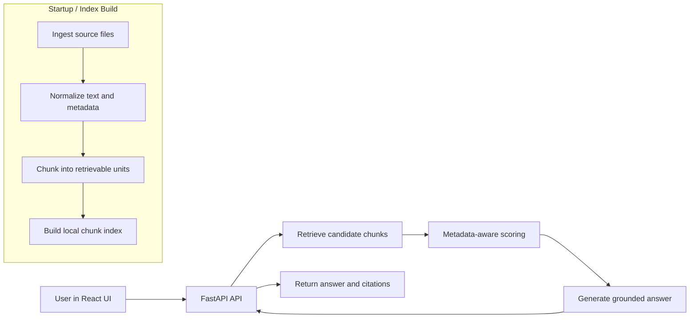

# SCARAG
Schema-Conscious Agnostic RAG (Retrieval-Augmented Generation)

**Metadata-first RAG for any domain, and supported format**

T. Transou - June 2026 - Active Development

## One-Sentence Claim
SCARAG is a metadata-first RAG framework for building document-grounded systems where provenance, lifecycle, confidence, and domain semantics are first-class concerns.

## Why SCARAG Exists
- Naive RAG treats documents as text blobs.
- Real implementation corpora are governed artifacts.
- Reliable answers require metadata-aware retrieval, lifecycle controls, confidence assessment, and evidence visibility.

SCARAG is not trying to make generation sound confident. It is designed to make evidence legible, traceable, and governable.

## Implementation Status
This repository is a public framework baseline of the SCARAG framework, developed from framework documentation and architectural notes.

This README serves four roles at once:
- project overview,
- implementation roadmap,
- implementation guide,
- truthful description of what the current public code does today.

Some sections describe implemented functionality in this repository. Other sections are explicit roadmap targets that define what still needs to be built. Those targets remain here by design.

## Core Premise
Most RAG systems fail long before generation quality becomes the main issue. They fail because retrieval lacks evidence governance: source identity, metadata quality, freshness, lifecycle state, and domain semantics.

SCARAG treats retrieval as evidence governance, not only similarity search.

## What the Name Means
SCARAG = Schema-Conscious Agnostic RAG.

Schema-Conscious:
- schema is treated as an interpretive layer, not a convenience layer,
- retrieval quality depends on explicit source meaning and metadata state.

Agnostic:
- the framework is domain-agnostic but not domain-indifferent,
- implementation teams are expected to tailor ontology, vocabulary, lifecycle policy, and confidence behavior by domain.

RAG:
- retrieval-augmented generation remains the operating pattern,
- answers are expected to remain anchored to retrieved evidence and provenance.

In short: agnostic does not mean generic.

## Design and Evaluation Philosophy
First things first:
- Schema before generation
- Provenance before fluency
- Domain tailoring before generic automation
- Abstention before unsupported synthesis
- Retrieval as evidence governance, not only similarity search

Evaluation is used as diagnosis, not decoration.

The objective is not one benchmark number. The objective is failure visibility: ingestion, chunking, retrieval, metadata weighting, tabular grounding, abstention behavior, evidence presentation, and generation behavior should all be diagnosable.

SCARAG is a framework posture, not only a code package:
- make evidence legible before asking the model to speak,
- treat abstention as correct behavior when support is weak,
- keep framework primitives separate from implementation-specific deployment and provider choices.

## Architecture at a Glance


## Capability Matrix
| Capability | Current public status | Current implementation surface | Roadmap alignment / next step |
|---|---|---|---|
| multi-format ingestion | Partial | scarag/ingestion/loader.py handles txt, md, json, csv, html/htm, mhtml/mht, pdf, docx, pptx, xlsx/xls | Harden parsers and add richer extraction metadata and error diagnostics |
| document type inference | Implemented | scarag/pipeline.py infer_doc_type | Expand taxonomy and profile-driven typing |
| prose chunking | Implemented | scarag/pipeline.py _chunk_prose | Add cohesion-aware splitting and policy-tuned chunking |
| tabular chunking | Partial | scarag/pipeline.py _looks_tabular + _chunk_tabular row windows | Improve table detection and row/header fidelity across formats |
| metadata propagation | Partial | chunk fields include source, chunk_id, doc_type, domain_area, is_tabular, content_fingerprint | Add extraction_method, lifecycle metadata, and persistent state propagation |
| provenance/citations | Partial | api_server.py citation envelope and frontend evidence drawer | Enforce richer provenance contract and source-resolvable linking |
| thesaurus/query expansion | Implemented | config/synonyms.json + scarag/pipeline.py expand_query_terms | Add profile overlays, governance for term drift, and diagnostics |
| lexical retrieval | Implemented | scarag/pipeline.py retrieve_chunks token overlap + doc_type weighting | Tune weights and add calibration tooling |
| vector or TF-IDF retrieval | Roadmap target | Not implemented in current public pipeline | Add TF-IDF/vector backend and score normalization path |
| hybrid reranking | Roadmap target | Not implemented; simple lexical weighting only | Add hybrid retrieval and rerank strategies with diagnostics |
| confidence resolver | Roadmap target | api_server.py exposes simple high/low/abstain signal, no resolver module | Build confidence framework from extraction metadata and overlays |
| lifecycle/freshness controls | Roadmap target | No persistent lifecycle state; no freshness filtering in retrieval | Add lifecycle metadata model, freshness filters, and stateful re-ingestion |
| soft delete/re-ingestion state | Roadmap target | No re-ingestion state store in current code | Add state path, soft delete markers, and audit timeline tooling |
| tabular grounding | Partial | tabular intent detection plus abstention when no tabular evidence | Add matched-row grounding and stricter row-faithful answering |
| generation modes | Partial | extractive, mock, live placeholder in scarag/generation/answerer.py | Add provider adapters and stronger grounding-aware generation contracts |
| citation response contract | Implemented | docs/reference-ui-contract.md and api_server.py response fields | Expand contract tests and richer citation metadata |
| reference API | Implemented | api_server.py /api/health and /api/chat | Add config endpoints and diagnostic surfaces |
| reference UI | Partial | frontend/src/App.jsx and styles.css implement shell, drawer, feedback scaffold | Wire feedback persistence and expand evidence interactions |
| offline evaluation | Partial | scripts/run_eval.py outputs JSON/Markdown reports | Add richer datasets, correction of metric naming, and deeper governance checks |
| domain profiles | Partial | profiles/default.json + RagConfig.from_profile | Add domain-specific profiles and confidence overlays |
| deployment guidance | Partial | start scripts and README run path | Add deployment playbooks and cloud adapter references |

## Operational Design Docs
The README is intentionally philosophy-first and status-oriented. Detailed operational and implementation design is maintained in the docs set below.

- Implementation tracking: docs/implementation-status.md
- Metadata model: docs/metadata-model.md
- Retrieval design: docs/retrieval-design.md
- Lifecycle and freshness design: docs/lifecycle-design.md
- Confidence framework design: docs/confidence-framework.md
- Tabular grounding design: docs/tabular-grounding.md

## Current Public Surfaces
- Core package: scarag/
- Reference API: api_server.py
- Reference UI: frontend/
- Operational scripts: scripts/
- Configuration and synonyms: config/
- Domain profiles: profiles/
- Offline evaluation workspace: eval/
- Regression tests: tests/
- Design and contract docs: docs/

## Framework Capabilities
### Ingestion and Chunking - Status: Partial
Current implementation baseline:
- Parses txt, md, json, csv, html/htm, mhtml/mht, pdf, docx, pptx, xlsx/xls.
- Creates prose chunks with chunk size, overlap, and minimum word controls.
- Detects table-like content heuristically and chunk by row windows.
- Suppresses duplicate full-document fingerprints during indexing.

Roadmap targets:
- richer extraction metadata (extraction method and extraction timestamp),
- stronger table detection and table-structure preservation,
- lifecycle-aware ingestion state and re-ingestion behavior.

### Schema-Conscious Retrieval and Metadata-First Scoring - Status: Partial
Current implementation baseline:
- Query expansion from config/synonyms.json.
- Lexical overlap retrieval with doc_type-aware weighting.
- top_k and minimum retrieval score controls.

Important correction:
- The current public framework baseline uses lexical overlap retrieval.
- TF-IDF/vector retrieval and hybrid reranking remain roadmap targets.

### Provenance and Evidence Presentation - Status: Partial
Current implementation baseline:
- API returns message, citations_summary, citations, collapsed_citations, answer, confidence.
- Frontend renders answer-first with right-side evidence drawer.
- Evidence cards are visible and low-signal cards can be collapsed.

Roadmap targets:
- stronger provenance completeness rules,
- source-resolvable links and richer citation metadata validation.

### Lifecycle and Freshness - Status: Roadmap target
Current implementation baseline:
- Basic source metadata is propagated on chunks.

Important correction:
- Persistent lifecycle state, freshness filtering, and soft-delete/re-ingestion controls are roadmap targets and are not fully implemented in current public code.

### Confidence Assessment - Status: Roadmap target
Current implementation baseline:
- API exposes a lightweight confidence signal (high, low, abstain).

Important correction:
- The confidence framework described in SCARAG design docs is part of the implementation roadmap; a full confidence resolver is not yet implemented.

### Domain Profiles and Ontology/Taxonomy Tailoring - Status: Partial
Current implementation baseline:
- profiles/default.json is loadable through RagConfig.from_profile.
- Synonym and tabular intent vocabulary are configurable in config/synonyms.json.

Roadmap targets:
- richer domain profiles,
- profile overlays for retrieval/lifecycle/confidence,
- ontology/taxonomy governance workflows.

### Tabular Grounding and Abstention - Status: Partial
Current implementation baseline:
- Tabular intent detection exists.
- If tabular intent is detected and no tabular evidence is retrieved, the system abstains.

Roadmap targets:
- matched-row grounding,
- stronger row/header fidelity rules,
- schema-style fallback policy controls.

### Evaluation as Diagnosis - Status: Partial
Current implementation baseline:
- scripts/run_eval.py runs offline evaluation and writes JSON/Markdown reports in eval/reports.
- Baseline metrics include retrieval, provenance completeness, abstention rate, and tabular compliance.

Roadmap targets:
- expanded datasets in eval/datasets,
- lifecycle/freshness compliance metrics once lifecycle state is implemented,
- richer semantic and human-reviewed evaluation layers.

### Framework Versus Implementation Boundaries - Status: Implemented
SCARAG intentionally separates framework primitives from implementation-specific choices.

Framework-owned surfaces in this repo:
- ingestion, chunking, retrieval baseline,
- answer contract and evidence presentation baseline,
- offline diagnostic evaluation baseline.

Implementation-owned surfaces:
- live LLM provider integration,
- deployment topology, auth, and observability,
- domain-specific policy and ontology governance.

## Reality Snapshot
- Generation modes available: extractive (default), mock, live placeholder.
- Live mode is an adapter hook and currently returns a clear provider-not-configured message.
- The React frontend is a reference implementation and can be replaced by implementers.
- Feedback capture is scaffolded in the UI but persistence wiring is not implemented.

## Run the Reference Stack (React + FastAPI)
Quick start from repo root:
```bash
bash ./start_everything.sh
```

This launches:
- React UI at http://127.0.0.1:3000
- API at http://127.0.0.1:8000

Health check:
```bash
curl http://127.0.0.1:8000/api/health
```

Manual startup:
```bash
cd frontend
npm install
npm run dev
```

In another terminal from repo root:
```bash
./.venv/bin/python -m uvicorn api_server:app --reload --host 127.0.0.1 --port 8000
```

## Contributor Guide
Primary edit surfaces:
- api_server.py: API contract, chat envelope, citation shaping.
- scarag/: ingestion, retrieval pipeline, generation modes, config behavior.
- frontend/src/App.jsx and frontend/src/styles.css: reference UI and evidence drawer behavior.
- scripts/: startup, dedupe, eval, workspace reset.
- docs/: design notes and UI/evaluation contracts.

Typical local workflow:
1. Run bash ./start_everything.sh.
2. Edit the smallest owning surface.
3. Re-run python -m pytest tests.
4. Update docs when contracts or behavior change.

## Repo Map (Current)
- scarag/
  - config.py: RagConfig and profile loading
  - ingestion/loader.py: file loading and format parsing
  - pipeline.py: chunking, doc typing, thesaurus, retrieval
  - retrieval/ranker.py: standalone overlap rank helper
  - generation/answerer.py: extractive/mock/live answer modes
- api_server.py
  - FastAPI endpoints and response envelope for the reference UI
- frontend/
  - React reference UI and evidence drawer shell
- scripts/
  - run_eval.py, dedupe_corpus.py, start/reset helpers
- eval/
  - datasets and reports workspace (gitkeep placeholders in clean clone)
- tests/
  - API and dependency/parser regression tests
- docs/
  - architecture notes, UI contract, evaluation blueprint

## Testing
```bash
python -m pytest tests
```

## Documentation Expansion Plan
If README detail continues to grow, keep philosophy and matrix here, and move deep operational design into dedicated docs:
- docs/implementation-status.md
- docs/metadata-model.md
- docs/retrieval-design.md
- docs/lifecycle-design.md
- docs/confidence-framework.md
- docs/tabular-grounding.md

These files are recommended next additions for active implementation clarity.

## Bibliography and Attribution
SCARAG draws on established work in retrieval-augmented generation, attribution, and evaluation.

- Lewis et al. Retrieval-Augmented Generation for Knowledge-Intensive NLP Tasks (2020)
- Asai et al. Self-RAG (2023)
- Gao et al. Retrieval-Augmented Generation for Large Language Models: A Survey (2023)
- Es et al. RAGAS (2023)
- Bohnet et al. Attributed Question Answering (2022)
- Yue et al. Automatic Evaluation and Improvement of Attribution in LLMs (2023)
- Nakano et al. WebGPT (2021)
- Ouyang et al. Training Language Models to Follow Instructions with Human Feedback (2022)

Where SCARAG makes claims about robustness, abstention, provenance, confidence, or evaluation design, implementation work should prefer cited literature and explicit diagnostics over unsupported assertions.
