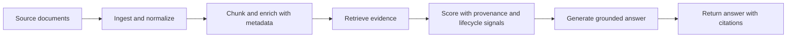
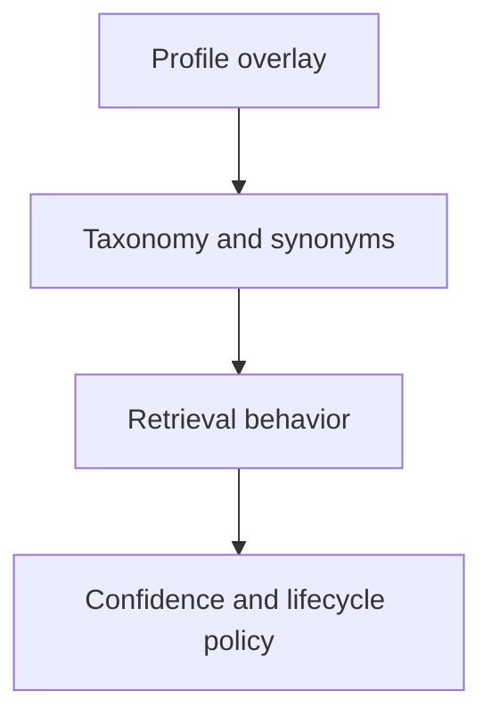

# SCARAG 🐦‍⬛
Schema-Conscious Agnostic RAG (Retrieval-Augmented Generation)

**Metadata-first RAG tuned for the Shakespeare corpus in this branch**

T. Transou - June 2026 - Active Development 🚧

SCARAG is a framework for building retrieval-augmented systems that treat evidence, provenance, lifecycle state, and domain semantics as first-class design concerns. It is intended for implementors who need a grounded and auditable RAG stack rather than an opaque text-only retrieval shortcut.

SCARAG functions as a governed context layer: detailed definition and proof criteria are documented in [docs/philosophy.md](docs/philosophy.md) and [docs/evaluation-blueprint.md](docs/evaluation-blueprint.md).

## Table of Contents
- [One-Sentence Claim](#one-sentence-claim)
- [Why SCARAG Exists](#why-scarag-exists)
- [Branch Positioning](#branch-positioning)
- [Core Premise](#core-premise)
- [What the Name Means](#what-the-name-means)
- [Design and Evaluation Philosophy](#design-and-evaluation-philosophy)
- [Architecture at a Glance](#architecture-at-a-glance)
- [Core Components](#core-components)
- [Operational Design Docs](#operational-design-docs)
- [Current Surfaces](#current-surfaces)
- [Implementation Capabilities](#implementation-capabilities)
- [Core Versus Branch-Specific Boundaries](#core-versus-branch-specific-boundaries)
- [Reality Snapshot](#reality-snapshot)
- [Environment Assumptions](#environment-assumptions)
- [Run the Reference Stack (React + FastAPI)](#run-the-reference-stack-react--fastapi)
- [Contributor Guide](#contributor-guide)
- [Repo Map (Current)](#repo-map-current)

## One-Sentence Claim
This branch of SCARAG is a metadata-first RAG implementation tuned for Shakespeare corpus retrieval, where provenance, lifecycle, confidence, and source-work semantics are first-class concerns.

## Why SCARAG Exists
The central claim is simple: retrieval systems should make evidence legible, not merely fluent.

- Naive RAG often treats documents as interchangeable text blobs.
- Real corpora are governed artifacts with provenance, lifecycle state, and domain-specific meaning.
- Reliable answers depend on metadata-aware retrieval, confidence assessment, and visible evidence.

SCARAG is not designed to make generation sound more confident. It is designed to make evidence legible, traceable, and governable.

## Branch Positioning
This repository branch is the Shakespeare-focused implementation surface for SCARAG. It keeps the core SCARAG pipeline, but the default runtime, corpus assumptions, and profile guidance are streamlined around mixed-format Shakespeare works rather than a generic cross-domain baseline.

The README is written as a practical orientation document rather than a changelog. Detailed implementation status, corpus-specific profile notes, and evolving development history belong in the documentation set under docs/.

## Core Premise
Most RAG systems fail long before generation quality becomes the main issue. They fail because retrieval lacks evidence governance: source identity, metadata quality, freshness, lifecycle state, and domain semantics.

SCARAG treats retrieval as evidence governance, not only similarity search.

## What the Name Means
SCARAG = Schema-Conscious Agnostic RAG.

- **Schema-Conscious:** schema is treated as an interpretive layer, not a convenience layer; retrieval quality depends on explicit source meaning and metadata state.
- **Agnostic:** the core design remains domain-agnostic, but this branch deliberately applies it to Shakespeare-specific ontology, vocabulary, lifecycle policy, and confidence behavior.
- **RAG:** retrieval-augmented generation remains the operating pattern; answers are expected to remain anchored to retrieved evidence and provenance.

In short, agnostic does not mean generic.

## Design and Evaluation Philosophy
SCARAG is guided by a few clear priorities:

- **Schema before generation**
- **Provenance before fluency**
- **Domain tailoring before generic automation**
- **Abstention before unsupported synthesis**
- **Retrieval as evidence governance, not only similarity search**

Evaluation is used as diagnosis, not decoration.

The objective is not one benchmark number. The objective is failure visibility: ingestion, chunking, retrieval, metadata weighting, tabular grounding, abstention behavior, evidence presentation, and generation behavior should all be diagnosable.

SCARAG remains a framework posture, not only a code package. This branch applies that posture to a concrete Shakespeare corpus so evidence remains legible before the model speaks, abstention remains acceptable when support is weak, and source-work signals stay explicit in retrieval.

## Architecture at a Glance

```mermaid
graph LR
    A[Source documents] --> B[Ingest and normalize]
    B --> C[Chunk and enrich with metadata]
    C --> D[Retrieve evidence]
    D --> E[Score with provenance and lifecycle signals]
    E --> F[Generate grounded answer]
    F --> G[Return answer with citations]
```

A simple view of the core pipeline: ingest, structure, retrieve, score, and ground the answer in evidence.


```mermaid
flowchart TB
    P[Profile overlay] --> T[Taxonomy and synonyms]
    T --> R[Retrieval behavior]
    R --> C[Confidence and lifecycle policy]
```

The default profile layer in this branch adapts vocabulary, document types, and retrieval behavior to Shakespeare without changing the framework core.

## Core Components
The repository includes the implementation layers used by the Shakespeare corpus workflow:

- ingestion and normalization for mixed document formats,
- chunking and source-unit segmentation,
- metadata-aware retrieval and ranking,
- lifecycle and freshness controls,
- provenance-aware answer generation,
- and evaluation surfaces for diagnostic inspection.

These are described in detail in the [Documentation Map (Current)](#documentation-map-current).

## Operational Design Docs
The README stays high-level. Detailed implementation notes, contracts, Shakespeare profile guidance, and evaluation references are maintained in the [Documentation Map (Current)](#documentation-map-current).

## Current Surfaces
- Core framework package: [scarag/](scarag)
- Reference API: [api_server.py](api_server.py)
- Reference UI: [frontend/](frontend)
- Operations and evaluation scripts: [scripts/](scripts)
- Shakespeare-oriented configuration and profiles: [config/](config) and [profiles/](profiles)
- Validation and diagnostics assets: [tests/](tests), [eval/](eval), and [docs/](docs)

## Implementation Capabilities
The implementation demonstrates the branch's main capabilities across five core areas:

- ingestion and normalization of mixed document formats,
- chunking and source-unit segmentation,
- metadata-aware retrieval and ranking,
- provenance-aware answer generation and evidence presentation,
- and evaluation surfaces for inspecting retrieval behavior and failure modes.

The detailed mechanics for each area are documented in the [Documentation Map (Current)](#documentation-map-current).

## Core Versus Branch-Specific Boundaries
SCARAG still separates framework primitives from branch-specific choices.

- **Core SCARAG surfaces** include the retrieval and evidence pipeline, reference API and UI structure, and baseline evaluation tooling.
- **Shakespeare branch surfaces** include the default profile, corpus inventory, source-work taxonomy, and retrieval vocabulary.

### Default profile for this branch
The default runtime profile in this branch is [profiles/shakespeare_test.json](profiles/shakespeare_test.json). It is documented in [docs/shakespeare-test-profile.md](docs/shakespeare-test-profile.md) and drives source-work-aware retrieval, Shakespeare-specific document typing, and branch corpus assumptions.

For explicit deployment ownership boundaries, see [docs/deployment-boundaries.md](docs/deployment-boundaries.md).

## Reality Snapshot
- Default runtime profile is `shakespeare_test` for this branch.
- Generation modes available: extractive (default), mock, and live placeholder.
- Live mode is an adapter hook and currently returns a clear provider-not-configured message.
- Generation returns structured grounding diagnostics, including abstention reason codes and cited chunk ids, behind the API envelope.
- Ingestion parser baseline includes txt/md/json/csv/html/mhtml/pdf/docx/pptx/xlsx/xls plus XML (`.xml`) and legacy DOC (`.doc`) coverage.
- Ingestion now emits explicit diagnostics for parser path and skip reasons, including unsupported formats and internal framework artifacts.
- Internal lifecycle artifacts (`.scarag_lifecycle_state.json`, `.scarag_lifecycle_audit.jsonl`) are excluded from ingestion to avoid self-indexing.
- Chunk metadata now separates chunk-level fields from compact document-level metadata (`document_metadata`) to reduce payload bloat.
- Non-persistent ingestion mode is available for exploratory runs (`ingestion_persist_lifecycle_state=False`).
- The React frontend is a reference implementation and may be replaced by implementers.
- Feedback capture is scaffolded in the UI, but persistence wiring is not implemented.
- API responses include a `contract_version` field, and migration notes for response-field evolution are tracked in [docs/api-contract-migrations.md](docs/api-contract-migrations.md).
- API includes `GET /api/ingestion/diagnostics` for ingestion-stage inspection.

## Environment Assumptions
- Python: a Python 3 environment is available, and local workflow assumes a project virtual environment (for example `./.venv`).
- Python dependencies: install from `requirements.txt` before running API or tests.
- Node.js: an LTS Node runtime is available for the reference frontend.
- Frontend dependencies: install from `frontend/package.json` before running the UI.
- Corpus layout: default corpus path is `data/`; evaluator datasets live under `eval/datasets`; evaluator reports are written to `eval/reports`.
- Default branch profile: `shakespeare_test`; override it only when intentionally comparing other overlays.
- Startup commands: baseline startup path is `bash ./start_everything.sh`; manual frontend/API startup commands are documented below.

## Run the Reference Stack (React + FastAPI)
Quick start from repo root:
```bash
bash ./start_everything.sh
```

This launches:
- React UI at http://127.0.0.1:3000
- API at http://127.0.0.1:8000

Health check:
```bash
curl http://127.0.0.1:8000/api/health
```

Manual startup:
```bash
cd frontend
npm install
npm run dev
```

In another terminal from repo root:
```bash
./.venv/bin/python -m uvicorn api_server:app --reload --host 127.0.0.1 --port 8000
```

## Contributor Guide
Primary edit surfaces:
- api_server.py: API contract, chat envelope, citation shaping.
- scarag/: ingestion, retrieval pipeline, generation modes, and Shakespeare-first config defaults.
- frontend/src/App.jsx and frontend/src/styles.css: reference UI and evidence drawer behavior.
- frontend/src/responseNormalization.js: frontend response normalization and legacy payload fallback behavior.
- scripts/: startup, dedupe, eval, workspace reset.
- docs/: design notes and UI/evaluation contracts.

Typical local workflow:
1. Run bash ./start_everything.sh.
2. Edit the smallest owning surface.
3. Re-run python -m pytest tests.
4. Update docs when contracts or behavior change.

## Repo Map (Current)
```text
.
├── scarag/
│   ├── config.py                 # RagConfig and profile loading
│   ├── ingestion/loader.py       # File loading and format parsing
│   ├── pipeline.py               # Chunking, doc typing, thesaurus, retrieval
│   ├── retrieval/ranker.py       # Standalone overlap rank helper
│   └── generation/answerer.py    # Extractive/mock/live answer modes
├── api_server.py                 # FastAPI endpoints and response envelope for the reference UI
├── frontend/                     # React reference UI and evidence drawer shell
├── scripts/                      # run_eval.py, dedupe_corpus.py, start/reset helpers
├── eval/                         # Datasets and reports workspace (gitkeep placeholders in clean clone)
├── tests/                        # API and dependency/parser regression tests
└── docs/                         # Architecture notes, UI contract, evaluation blueprint
```

## Testing
```bash
python -m pytest tests
```

## Documentation Map (Current)
README stays high-level. Detailed design and behavior documentation lives in [docs/](docs).

Recommended entry points:
- Framework status and orientation: [docs/implementation-status.md](docs/implementation-status.md), [docs/philosophy.md](docs/philosophy.md)
- Core architecture and contracts: [docs/metadata-model.md](docs/metadata-model.md), [docs/retrieval-design.md](docs/retrieval-design.md), [docs/lifecycle-design.md](docs/lifecycle-design.md), [docs/confidence-framework.md](docs/confidence-framework.md), [docs/tabular-grounding.md](docs/tabular-grounding.md), [docs/generation-contract.md](docs/generation-contract.md), [docs/api-contract-migrations.md](docs/api-contract-migrations.md)
- Frontend behavior: [docs/reference-ui-contract.md](docs/reference-ui-contract.md), [docs/frontend-principles.md](docs/frontend-principles.md), [docs/frontend-state-model.md](docs/frontend-state-model.md)
- Profiles and tailoring: [docs/shakespeare-test-profile.md](docs/shakespeare-test-profile.md), [docs/profile-catalog.md](docs/profile-catalog.md), [docs/nlp-tailoring-guide.md](docs/nlp-tailoring-guide.md)
- Evaluation: [docs/evaluation-blueprint.md](docs/evaluation-blueprint.md)

## Bibliography

SCARAG is informed by work in retrieval-augmented generation, attributed question answering, RAG evaluation, and instruction-following language models.

### Retrieval-Augmented Generation

- Lewis, Patrick, et al. “Retrieval-Augmented Generation for Knowledge-Intensive NLP Tasks.” 2020.
  🐦‍⬛SCARAG rationale: establishes the baseline retrieve-then-generate pattern SCARAG extends with stronger metadata and provenance governance.

- Gao, Yunfan, et al. “Retrieval-Augmented Generation for Large Language Models: A Survey.” 2023.
 🐦‍⬛SCARAG rationale: frames the modern RAG design space and motivates explicit treatment of retrieval controls, chunking, and grounding tradeoffs.

- Asai, Akari, et al. “Self-RAG: Learning to Retrieve, Generate, and Critique through Self-Reflection.” 2023.
 🐦‍⬛SCARAG rationale: informs critique/abstention-oriented behavior and supports the framework posture that generation should reflect evidence quality.

### RAG Evaluation

- Es, Shahul, et al. “RAGAS: Automated Evaluation of Retrieval Augmented Generation.” 2023.
  🐦‍⬛SCARAG rationale: supports layered evaluation dimensions (faithfulness, context quality, answer relevance) beyond single-score benchmarking.

### Attribution and Source Grounding

- Bohnet, Bernd, et al. “Attributed Question Answering: Evaluation and Modeling for Attributed Large Language Models.” 2022.
  🐦‍⬛SCARAG rationale: reinforces attribution as a first-class output requirement rather than optional UI decoration.

- Yue, Xiang, et al. “Automatic Evaluation of Attribution by Large Language Models.” 2023.
  🐦‍⬛SCARAG rationale: informs evaluation expectations for citation support and provenance completeness.

- Nakano, Reiichiro, et al. “WebGPT: Improving the Factual Accuracy of Language Models through Web Browsing.” 2021.
  🐦‍⬛SCARAG rationale: motivates explicit evidence exposure and reviewer-traceable support in grounded responses.

### Instruction-Following and Human Feedback

- Ouyang, Long, et al. “Training Language Models to Follow Instructions with Human Feedback.” 2022.
  🐦‍⬛SCARAG rationale: informs human-in-the-loop alignment posture while preserving abstention and evidence-backed answer constraints.

Where SCARAG makes claims about robustness, abstention, provenance, confidence, or evaluation design, implementation work should prefer cited literature and explicit diagnostics over unsupported assertions.
