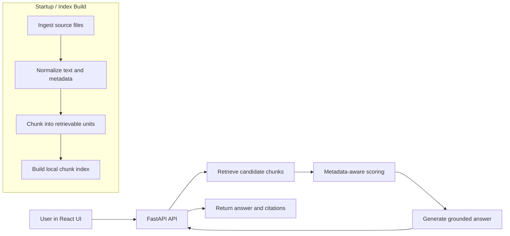

# SCARAG
Schema-Conscious Agnostic RAG (Retrieval-Augmented Generation)

**Metadata-first RAG for any domain, and supported format**

T. Transou - June 2026 - Active Development 🚧

## One-Sentence Claim
SCARAG is a metadata-first RAG framework for building document-grounded systems where provenance, lifecycle, confidence, and domain semantics are first-class concerns.

## Why SCARAG Exists
- Naive RAG treats documents as text blobs.
- Real implementation corpora are governed artifacts.
- Reliable answers require metadata-aware retrieval, lifecycle controls, confidence assessment, and evidence visibility.

SCARAG is not trying to make generation sound confident. It is designed to make evidence legible, traceable, and governable.

## Why a Humanities Profile Matters
This repository includes a humanities-oriented profile because the framework is meant to be useful for people working with cultural heritage, archival, textual, and art-historical materials, not only for corporate policy or technical documentation.

A humanities background can be a strong starting point for building a practical RAG workflow that is evidence-aware and interpretable. The humanities profile is intended to help someone begin with familiar concepts such as provenance, attribution, edition, transcription, and archival context, while keeping the system grounded in document metadata rather than treating everything as interchangeable text.

The goal is not to claim that one profile is universally correct. It is to show a concrete, reusable pattern: implementors in other domains can create their own profiles with tailored taxonomies, synonyms, lifecycle rules, and confidence behavior. SCARAG is meant to support that kind of domain-specific adaptation rather than lock users into a single generic setup.

## Framework Positioning
This repository is a public framework baseline for SCARAG. It is intended to document the framework's core principles, reference implementation surfaces, and the kinds of design decisions that matter when adapting the system to a new domain.

The README is written as a practical orientation document rather than a changelog. Detailed implementation status, roadmap notes, and evolving development history belong in the more expansive documentation set under docs/.

## Core Premise
Most RAG systems fail long before generation quality becomes the main issue. They fail because retrieval lacks evidence governance: source identity, metadata quality, freshness, lifecycle state, and domain semantics.

SCARAG treats retrieval as evidence governance, not only similarity search.

## What the Name Means
SCARAG = Schema-Conscious Agnostic RAG.

Schema-Conscious:
- schema is treated as an interpretive layer, not a convenience layer,
- retrieval quality depends on explicit source meaning and metadata state.

Agnostic:
- the framework is domain-agnostic but not domain-indifferent,
- implementation teams are expected to tailor ontology, vocabulary, lifecycle policy, and confidence behavior by domain.

RAG:
- retrieval-augmented generation remains the operating pattern,
- answers are expected to remain anchored to retrieved evidence and provenance.

In short: agnostic does not mean generic.

## Design and Evaluation Philosophy
First things first:
- Schema before generation
- Provenance before fluency
- Domain tailoring before generic automation
- Abstention before unsupported synthesis
- Retrieval as evidence governance, not only similarity search

Evaluation is used as diagnosis, not decoration.

The objective is not one benchmark number. The objective is failure visibility: ingestion, chunking, retrieval, metadata weighting, tabular grounding, abstention behavior, evidence presentation, and generation behavior should all be diagnosable.

SCARAG is a framework posture, not only a code package:
- make evidence legible before asking the model to speak,
- treat abstention as correct behavior when support is weak,
- keep framework primitives separate from implementation-specific deployment and provider choices.

## Architecture at a Glance

```mermaid
graph LR
    subgraph Startup_Index_Build [Startup / Index Build]
        A[Ingest source files] --> B[Normalize text and metadata]
        B --> C[Chunk into retrievable units]
        C --> D[Build local chunk index]
    end

    E[User in React UI] --> F[FastAPI API]
    F --> G[Retrieve candidate chunks]
    G --> H[Metadata-aware scoring]
    H --> I[Generate grounded answer]
    I --> F
    F --> J[Return answer and citations]
```

## Framework Components
The repository includes a reference implementation that demonstrates the framework's core layers:

- ingestion and normalization for mixed document formats,
- chunking and source-unit segmentation,
- metadata-aware retrieval and ranking,
- lifecycle and freshness controls,
- provenance-aware answer generation,
- and evaluation surfaces for diagnostic inspection.

These are described more fully in the operational documents under docs/.

## Operational Design Docs
The README is intentionally framework-oriented and explanatory. Detailed implementation notes, status tracking, and evolving design details are maintained in the docs set below.

- Implementation tracking: docs/implementation-status.md
- Metadata model: docs/metadata-model.md
- Retrieval design: docs/retrieval-design.md
- Lifecycle and freshness design: docs/lifecycle-design.md
- Confidence framework design: docs/confidence-framework.md
- Tabular grounding design: docs/tabular-grounding.md
- Grounded answer contract: docs/generation-contract.md
- API contract migrations: docs/api-contract-migrations.md
- Deployment boundaries: docs/deployment-boundaries.md
- NLP tailoring starter guide: docs/nlp-tailoring-guide.md

## Current Public Surfaces
- Core package: scarag/
- Reference API: api_server.py
- Reference UI: frontend/
- Operational scripts: scripts/
- Configuration and synonyms: config/
- Fallback template scaffold: config/fallback_template.json
- Domain profiles: profiles/
- Offline evaluation workspace: eval/
- Regression tests: tests/
- Design and contract docs: docs/

## Framework Capabilities
The reference implementation demonstrates the framework's main capabilities across five core areas:

- ingestion and normalization of mixed document formats,
- chunking and source-unit segmentation,
- metadata-aware retrieval and ranking,
- provenance-aware answer generation and evidence presentation,
- and evaluation surfaces for inspecting retrieval behavior and failure modes.

The detailed mechanics for each area are documented in the operational design docs under docs/.

## Framework Versus Implementation Boundaries
SCARAG intentionally separates framework primitives from implementation-specific choices.

Framework-owned surfaces in this repository include the core retrieval and evidence pipeline, reference API and UI structure, and baseline evaluation tooling.

Implementation-owned surfaces include live provider integration, deployment topology, authentication, observability, and domain-specific ontology or policy governance.

For explicit deployment ownership boundaries, see docs/deployment-boundaries.md.

## Reality Snapshot
- Generation modes available: extractive (default), mock, live placeholder.
- Live mode is an adapter hook and currently returns a clear provider-not-configured message.
- Generation returns structured grounding diagnostics, including abstention reason codes and cited chunk ids, behind the API envelope.
- The React frontend is a reference implementation and can be replaced by implementers.
- Feedback capture is scaffolded in the UI but persistence wiring is not implemented.
- API responses now include a `contract_version` field, and migration notes for response-field evolution are tracked in docs/api-contract-migrations.md.

## Environment Assumptions
- Python: a Python 3 environment is available, and local workflow assumes a project virtual environment (for example `./.venv`).
- Python dependencies: install from `requirements.txt` before running API or tests.
- Node.js: an LTS Node runtime is available for the reference frontend.
- Frontend dependencies: install from `frontend/package.json` before running the UI.
- Corpus layout: default corpus path is `data/`; evaluator datasets live under `eval/datasets`; evaluator reports are written to `eval/reports`.
- Startup commands: baseline startup path is `bash ./start_everything.sh`; manual frontend/API startup commands are documented below.

## Run the Reference Stack (React + FastAPI)
Quick start from repo root:
```bash
bash ./start_everything.sh
```

This launches:
- React UI at http://127.0.0.1:3000
- API at http://127.0.0.1:8000

Health check:
```bash
curl http://127.0.0.1:8000/api/health
```

Manual startup:
```bash
cd frontend
npm install
npm run dev
```

In another terminal from repo root:
```bash
./.venv/bin/python -m uvicorn api_server:app --reload --host 127.0.0.1 --port 8000
```

## Contributor Guide
Primary edit surfaces:
- api_server.py: API contract, chat envelope, citation shaping.
- scarag/: ingestion, retrieval pipeline, generation modes, config behavior.
- frontend/src/App.jsx and frontend/src/styles.css: reference UI and evidence drawer behavior.
- frontend/src/responseNormalization.js: frontend response normalization and legacy payload fallback behavior.
- scripts/: startup, dedupe, eval, workspace reset.
- docs/: design notes and UI/evaluation contracts.

Typical local workflow:
1. Run bash ./start_everything.sh.
2. Edit the smallest owning surface.
3. Re-run python -m pytest tests.
4. Update docs when contracts or behavior change.

## Repo Map (Current)
- scarag/
  - config.py: RagConfig and profile loading
  - ingestion/loader.py: file loading and format parsing
  - pipeline.py: chunking, doc typing, thesaurus, retrieval
  - retrieval/ranker.py: standalone overlap rank helper
  - generation/answerer.py: extractive/mock/live answer modes
- api_server.py
  - FastAPI endpoints and response envelope for the reference UI
- frontend/
  - React reference UI and evidence drawer shell
- scripts/
  - run_eval.py, dedupe_corpus.py, start/reset helpers
- eval/
  - datasets and reports workspace (gitkeep placeholders in clean clone)
- tests/
  - API and dependency/parser regression tests
- docs/
  - architecture notes, UI contract, evaluation blueprint

## Testing
```bash
python -m pytest tests
```

## Documentation Expansion Plan
If README detail continues to grow, keep philosophy and matrix here, and move deep operational design into dedicated docs:
- docs/implementation-status.md
- docs/metadata-model.md
- docs/retrieval-design.md
- docs/lifecycle-design.md
- docs/confidence-framework.md
- docs/tabular-grounding.md

These files are recommended next additions for active implementation clarity.

## Bibliography

SCARAG is informed by work in retrieval-augmented generation, attributed question answering, RAG evaluation, and instruction-following language models.

### Retrieval-Augmented Generation

- Lewis, Patrick, et al. “Retrieval-Augmented Generation for Knowledge-Intensive NLP Tasks.” 2020.
  SCARAG rationale: establishes the baseline retrieve-then-generate pattern SCARAG extends with stronger metadata and provenance governance.

- Gao, Yunfan, et al. “Retrieval-Augmented Generation for Large Language Models: A Survey.” 2023.
  SCARAG rationale: frames the modern RAG design space and motivates explicit treatment of retrieval controls, chunking, and grounding tradeoffs.

- Asai, Akari, et al. “Self-RAG: Learning to Retrieve, Generate, and Critique through Self-Reflection.” 2023.
  SCARAG rationale: informs critique/abstention-oriented behavior and supports the framework posture that generation should reflect evidence quality.

### RAG Evaluation

- Es, Shahul, et al. “RAGAS: Automated Evaluation of Retrieval Augmented Generation.” 2023.
  SCARAG rationale: supports layered evaluation dimensions (faithfulness, context quality, answer relevance) beyond single-score benchmarking.

### Attribution and Source Grounding

- Bohnet, Bernd, et al. “Attributed Question Answering: Evaluation and Modeling for Attributed Large Language Models.” 2022.
  SCARAG rationale: reinforces attribution as a first-class output requirement rather than optional UI decoration.

- Yue, Xiang, et al. “Automatic Evaluation of Attribution by Large Language Models.” 2023.
  SCARAG rationale: informs evaluation expectations for citation support and provenance completeness.

- Nakano, Reiichiro, et al. “WebGPT: Improving the Factual Accuracy of Language Models through Web Browsing.” 2021.
  SCARAG rationale: motivates explicit evidence exposure and reviewer-traceable support in grounded responses.

### Instruction-Following and Human Feedback

- Ouyang, Long, et al. “Training Language Models to Follow Instructions with Human Feedback.” 2022.
  SCARAG rationale: informs human-in-the-loop alignment posture while preserving abstention and evidence-backed answer constraints.

Where SCARAG makes claims about robustness, abstention, provenance, confidence, or evaluation design, implementation work should prefer cited literature and explicit diagnostics over unsupported assertions.
